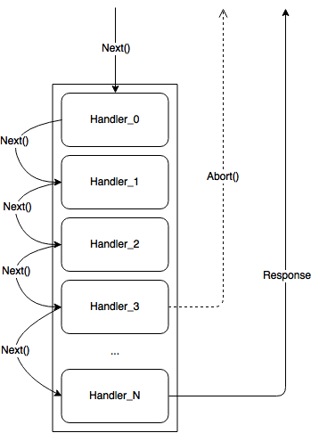

# Context

以下是 blademaster 中 Context 对象结构体声明的代码片段：
```go
// Context is the most important part. It allows us to pass variables between
// middleware, manage the flow, validate the JSON of a request and render a
// JSON response for example.
type Context struct {
    context.Context
 
    Request *http.Request
    Writer  http.ResponseWriter
 
    // flow control
    index    int8
    handlers []HandlerFunc
 
    // Keys is a key/value pair exclusively for the context of each request.
    Keys map[string]interface{}
 
    Error error
 
    method string
    engine *Engine
}
```

* 首先可以看到 blademaster 的 Context 结构体中会 embed 一个标准库中的 Context 实例，bm 中的 Context 也是直接通过该实例来实现标准库中的 Context 接口。
* blademaster 会使用配置的 server timeout (默认1s) 作为一次请求整个过程中的超时时间，使用该context调用dao做数据库、缓存操作查询时均会将该超时时间传递下去，一旦抵达deadline，后续相关操作均会返回`context deadline exceeded`。
* Request 和 Writer 字段用于获取当前请求的与输出响应。
* index 和 handlers 用于 handler 的流程控制；handlers 中存储了当前请求需要执行的所有 handler，index 用于标记当前正在执行的 handler 的索引位。
* Keys 用于在 handler 之间传递一些额外的信息。
* Error 用于存储整个请求处理过程中的错误。
* method 用于检查当前请求的 Method 是否与预定义的相匹配。
* engine 字段指向当前 blademaster 的 Engine 实例。

以下为 Context 中所有的公开的方法：
```go
// 用于 Handler 的流程控制
func (c *Context) Abort()
func (c *Context) AbortWithStatus(code int)
func (c *Context) Bytes(code int, contentType string, data ...[]byte)
func (c *Context) IsAborted() bool
func (c *Context) Next()
 
// 用户获取或者传递请求的额外信息
func (c *Context) RemoteIP() (cip string)
func (c *Context) Set(key string, value interface{})
func (c *Context) Get(key string) (value interface{}, exists bool)
  
// 用于校验请求的 payload
func (c *Context) Bind(obj interface{}) error
func (c *Context) BindWith(obj interface{}, b binding.Binding) error
  
// 用于输出响应
func (c *Context) Render(code int, r render.Render)
func (c *Context) Redirect(code int, location string)
func (c *Context) Status(code int)
func (c *Context) String(code int, format string, values ...interface{})
func (c *Context) XML(data interface{}, err error)
func (c *Context) JSON(data interface{}, err error)
func (c *Context) JSONMap(data map[string]interface{}, err error)
func (c *Context) Protobuf(data proto.Message, err error)
```

所有方法基本上可以分为三类：

* 流程控制
* 额外信息传递
* 请求处理
* 响应处理

# Handler



初次接触`blademaster`的用户可能会对其`Handler`的流程处理产生不小的疑惑，实际上`bm`对`Handler`对处理非常简单：

* 将`Router`模块中预先注册的`middleware`与其他`Handler`合并，放入`Context`的`handlers`字段，并将`index`字段置`0`
* 然后通过`Next()`方法一个个执行下去，部分`middleware`可能想要在过程中中断整个流程，此时可以使用`Abort()`方法提前结束处理
* 有些`middleware`还想在所有`Handler`执行完后再执行部分逻辑，此时可以在自身`Handler`中显式调用`Next()`方法，并将这些逻辑放在调用了`Next()`方法之后

# 扩展阅读

[bm快速开始](blademaster-quickstart.md)  
[bm中间件](blademaster-mid.md)  
[bm基于pb生成](blademaster-pb.md)  

-------------

[文档目录树](summary.md)
